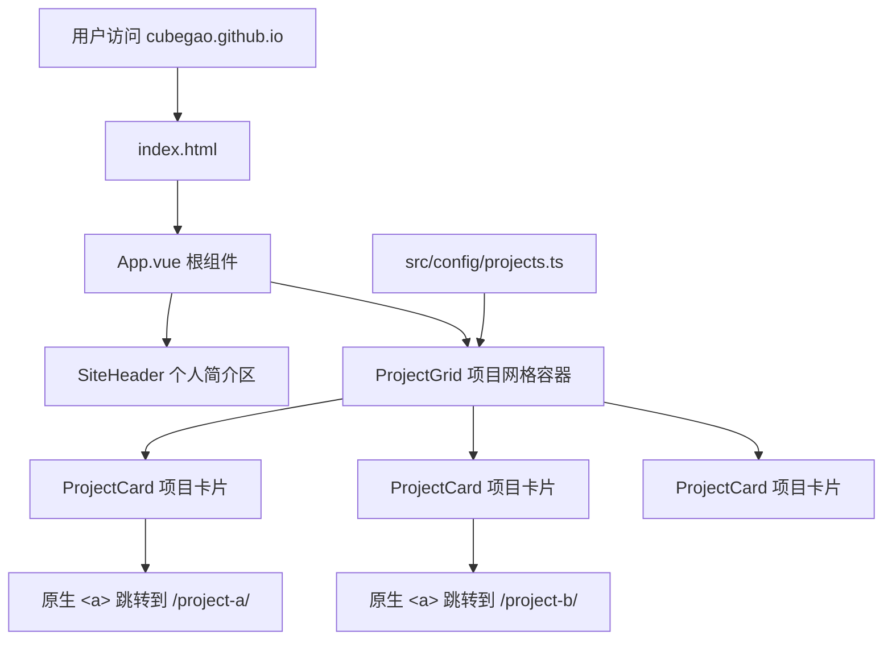

## 产品概述

将 `cubegao.github.io` 仓库改造成一个现代化的个人项目导航站（Project Showcase）。用户访问首页后可看到个人简介和项目卡片列表，点击卡片直接跳转到对应子目录的独立静态站点。

## 核心功能

- **个人简介区**：展示站点标题和描述文案，采用大标题 + 副标题的简洁布局
- **项目卡片列表**：以卡片网格形式展示所有项目，每张卡片包含项目名称、描述和标签
- **项目导航跳转**：点击卡片直接跳转到对应子目录（如 `/audiofield/`），无需 Vue Router
- **配置驱动**：项目列表通过一个 TypeScript 配置文件统一管理，新增项目只需添加配置项
- **响应式布局**：适配桌面端、平板端和手机端
- **自动部署**：通过 GitHub Actions 自动构建并部署到 GitHub Pages

## 技术栈

- **框架**：Vue 3（Composition API + `<script setup>`）
- **构建工具**：Vite
- **语言**：TypeScript
- **样式方案**：纯 CSS（使用 CSS 自定义属性 + 现代布局），不引入 UI 组件库以保持轻量和完全可控
- **CI/CD**：GitHub Actions，使用官方 `actions/deploy-pages-action` 直接部署到 GitHub Pages（不依赖 `gh-pages` 分支），每 push 到 `main` 分支自动触发
- **包管理**：pnpm（如不可用则 fallback 到 npm）

## 实现方案

### 整体策略

采用单页面应用（SPA）架构，无 Vue Router。整个站点只有一个首页，所有项目通过 `<a>` 标签原生跳转到子目录。这种设计最简洁，也最符合"首页只负责导航"的定位。

### 架构设计



### 数据流

```
projects.ts 配置文件 ——> App.vue 读取配置 ——> ProjectGrid 遍历渲染 ——> ProjectCard 展示并跳转
```

单向数据流，无状态管理需求，直接通过 props 传递数据。

### 关键技术决策

1. **不使用 Vue Router**：项目是独立静态站点，非 SPA 内部路由，用原生 `<a>` 标签跳转最简单可靠
2. **不使用 UI 组件库**：页面组件极少（仅 Header + Card），引入组件库反而增加包体积和样式覆盖成本
3. **TypeScript 配置文件**：相比 JSON，TS 配置提供类型检查和 IDE 智能提示，更适合维护
4. **CSS 自定义属性**：通过设计令牌（Design Tokens）统一管理颜色、间距、圆角等，便于主题扩展

### 性能考量

- Vite 构建产物极轻（纯静态 HTML + CSS + JS，无重型依赖）
- 零运行时状态管理开销
- 首屏加载体积预计 < 50KB gzipped
- 卡片图标使用 emoji 或 SVG，无外部图片请求

### 兼容性

- GitHub Pages 通过 `vite.config.ts` 中 `base: '/'`（默认值）确保资源路径正确
- 使用 GitHub 官方 Pages Actions 工作流：`actions/configure-pages-pages-action` + `actions/upload-pages-artifact` + `actions/deploy-pages-action`
- 源码始终在 `main` 分支，不依赖 `gh-pages` 分支，部署产物通过 Actions Artifact 传递
- 完全兼容 `cubegao.github.io` 用户主页仓库

## 设计风格

参考 Apple、Vercel、Linear 的设计语言，采用极简现代风格。大面积留白、精致排版、微妙的圆角和阴影过渡，营造专业、可信赖的技术感。

## 页面布局

页面采用垂直居中布局，从上到下依次为：

### 个人简介区（Hero）

- 大标题使用 48px 字号，字重 700，渐变色或深色纯色
- 副标题描述文字使用 18px，灰色调，行距宽松
- 可选：GitHub 图标链接或社交链接小图标行
- 整体居中对齐，上下留白充足（120px+）

### 项目卡片网格

- 使用 CSS Grid 自动适配列数（桌面 3 列，平板 2 列，手机 1 列）
- 卡片采用白色/浅灰背景，圆角 16px，悬停时上浮 + 阴影增强
- 每张卡片包含：项目图标（emoji）、项目名（20px 加粗）、描述文字（14px 灰色）、技术标签（小圆角标签）
- 卡片间距 24px，整体网格最大宽度 1080px 居中

### 页脚

- 极简版权或留空，不干扰主要内容

## 交互设计

- 卡片 hover 时 `translateY(-4px)` + 阴影扩散，过渡时间 200ms ease-out
- 卡片内链为整卡可点击区域
- 页面加载无闪烁，无路由切换动画

## 响应式

- ≥1024px：3 列网格，大标题 48px
- 768-1023px：2 列网格，大标题 40px
- <768px：1 列网格，大标题 32px，卡片全宽，内边距缩小

## Agent Extensions

### MCP

- **GitHub**
- 用途：在最终部署阶段，推送源码和 workflow 文件到 `main` 分支
- 预期结果：源码和 workflow 文件成功推送后，GitHub Actions 自动触发构建并通过官方 Pages Actions 部署到 GitHub Pages